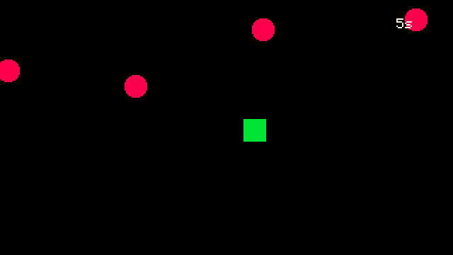
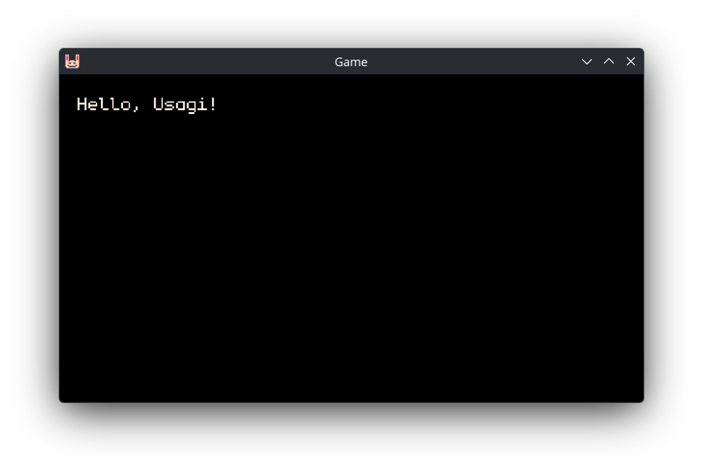
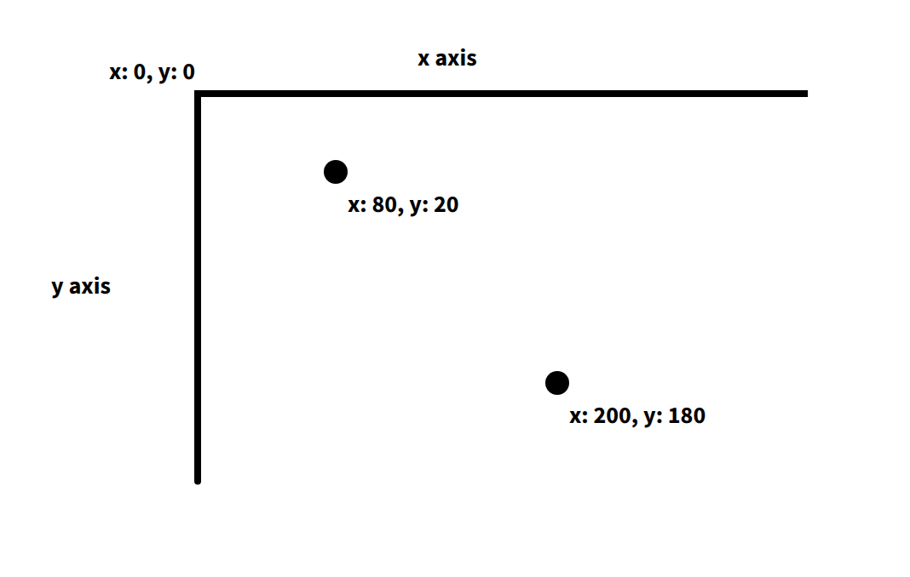
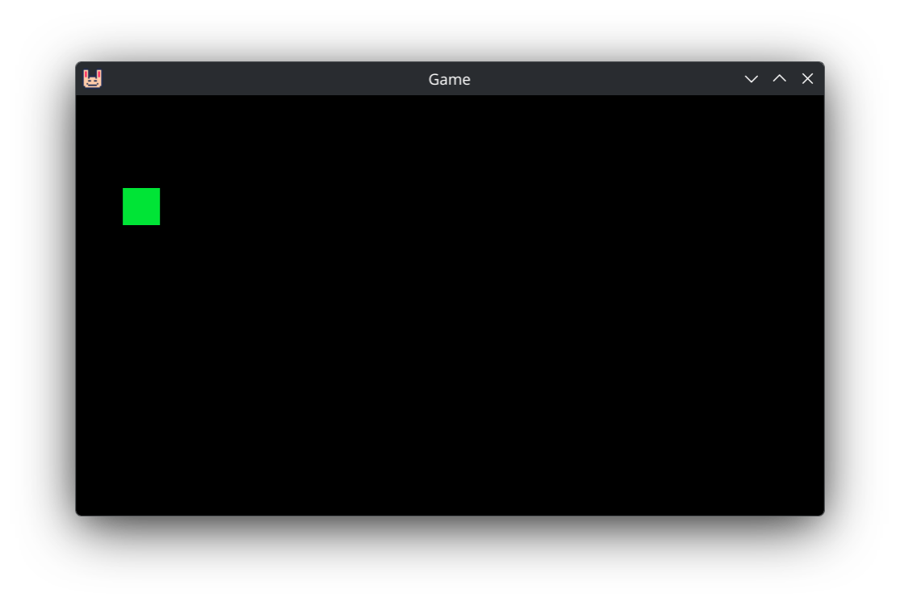
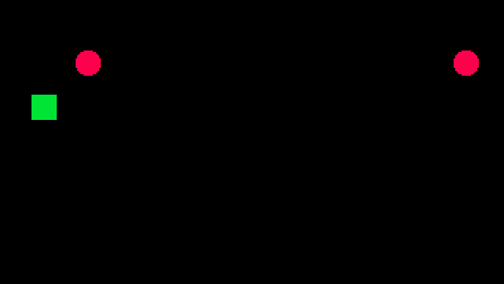

# Dodge 'Em Up

In this chapter we'll make a very simple game where you move a square around the
screen and dodge circles that fly at you. We'll cover all of the basics of
making a game with Usagi and then package up our game to share it with others.



## Initializing a New Game

Now that you've got Usagi installed, you'll have the `usagi` command available.
Go ahead and open your text editor. Many code editors include a way to open a
terminal/shell within it. If you're using a text editor that doesn't, then
launch your terminal or Command Prompt or PowerShell separately. Run
`usagi init hello_usagi`. This will create a folder called `hello_usagi` with a
bunch of different files in them. The most important one is `main.lua`, which is
the primary entrypoint for your game. It's where you'll start out coding.

`USAGI.md` contains the full and complete documentation for Usagi in the
Markdown format. You can open it up and browse it to learn all about what Usagi
can do. It's a user manual of sorts.

`meta/usagi.lua` is a file that helps your text editor know what functions and
variables are available from Usagi. You don't edit this file, it's read-only and
to help improve your experience writing code.

In your terminal, run `usagi dev hello_usagi`. You'll see a window pop up that
draws some text on the screen.



Then in your text editor, open `main.lua`. You'll see this:

```lua
{{#include code/01-dodge-em-up/01-init/main.lua}}
```

If this is your first time seeing code, congratulations! This is Lua.
`function`s are reusable pieces of code that can be called to make whatever code
is contained within the `function` and `end` run. We'll dive more into functions
soon. But let's walk through the code a bit more first.

`_config()` is a place where you can set your game's `name` and `game_id`. The
`game_id` is used for putting your game's save data in the proper location on
your players' computers. Don't worry about this too much yet.

`_init()` is a function that gets run when your game starts (and when you press
<kbd>F5</kbd> or <kbd>Ctrl+R</kbd>). It's a good place to set up data once.

Then `_update(dt)` and `_draw(dt)` are sort of siblings. They get called 60
times per second, over and over again, automatically by Usagi. This is called
**the game loop**. Games run rapidly so that movement is smooth and the game can
react quickly to player input. Each iteration through the loop is called a
**frame**, similar to how each image in a movie is a frame. Movies are often 24
frames per second (FPS), whereas games are often 60 FPS. The `_update` function
is where you check for player input, have entities in your game react to what's
happening, and simulate the game. There's nothing there yet, but there will be
soon. The `_draw` function is where you can show text, draw shapes, or put your
game's art on the screen.

`dt` is short for delta-time and it's passed into `_update` and `_draw`
automatically by the game engine. We'll cover it more in depth in a future
chapter. For now, it's unused and not something to worry about.

`gfx.clear(gfx.COLOR_BLACK)` clears the screen so that all that's shown is a
black rectangle. Each frame we clear the screen so that what was drawn on the
last frame doesn't reappear. Try changing `gfx.COLOR_BLACK` to `gfx.COLOR_RED`.
The background of your game instantly updates from black to red.

The next line `gfx.text("Hello, Usagi!", 10, 10, gfx.COLOR_WHITE)` is what draws
the message on the screen.

`_update` and `_draw` are functions we define ourselves, which Usagi looks for
and _calls_. `gfx.clear` and `gfx.text` are functions that Usagi provides, which
we _call_. Calling a function makes that code run. So `gfx.text` draws text to
the screen. It knows which text to draw, where to place it, and what color to
make it by passing in arguments. Arguments are comma-separated values that
correspond to the parameter list of the function. `gfx.text` expects the text
message to show, the x coordinate, the y coordinate, and the color of the text
as its arguments.

Try changing a few aspects of `gfx.text` and see what happens. Update the
message, change the `10`s, and use a different color.

Next, copy that line of code and paste it below. Draw a different message to the
screen in a different position. And don't forget to save your `main.lua` file.

You're coding! And Usagi is live updating, giving you instant feedback to your
changes.

Normally, in most game engines, you'd need to change your code, save it, and run
a command to start the game again. With Usagi, you just change it and save it
and see your changes.

The `x` and `y` parameters of the `gfx.text` function are the pixel coordinates
on our screen of where to place the upper-left corner of the text. The
upper-left corner of our game is the 0 x position and the 0 y position. If you
increase the `x` value, the text will move to the right. If you increase the `y`
value, it will move down.



By default, Usagi games are 320 pixels wide and 180 pixels tall. If you set the
`x` position of your text to `400`, it won't be visible in your game.

## Greeting

Let's write our own function. It's a great way to learn how functions work.
Rather than just greeting Usagi, let's make it easy to say hello to any given
name.

At the bottom of `main.lua`, add the following code:

```lua
{{#include code/01-dodge-em-up/02-greet/main.lua:21:23}}
```

Then, in `_draw`:

```lua
{{#include code/01-dodge-em-up/02-greet/main.lua:18}}
```

Try changing the name. What our updated `gfx.text` is doing is calling our new
`greet` function. We pass in the `name` we want to greet, wrapped in quotations
(note: these are not curly quotes; those are for writing prose, not coding).
When you wrap characters in quotations, this is called a **string** and it is
not evaluated as code. It's instead data that we can use in our code. The
`return` keyword in our function is what our function spits back to wherever
calls it. In our case, it passes the returned value into `gfx.text`. It draws
`"Hello, Alucard!"` on the screen. The `..` (two periods) is Lua's syntax for
how to combine strings. It squishes together `"Hello, "`, our `name` we pass in,
and `"!"` into a new string.

Add some other greetings to try out your new function.

Here's a simple function for adding two numbers and returning the result:

```lua
function add(a, b)
  return a + b
end
```

Functions can accept all sorts of data and return something that's computed
based on those values. You can see that `+` is used to calculate the sum of two
values in this example function. While `add` isn't something we'll use in our
game, it's useful to show what functions can be like. I tend to think of
functions as _verbs_, actions we want our code to take.

**Aside:** you have have noticed some lines of text starting with `--` in
`main.lua`. The double dash in Lua creates a **comment** which is code that's
not executed and is meant to be used to document how something works. Comments
are useful for future you (or collaborators) to remember what something does.
Throughout the book you'll see comments like: `-- px/s` to mean that the number
represents pixels per second for movement speed. I'll use comments to help
explain some of the code in our games.

[View the source code for this section.](https://codeberg.org/brettchalupa/usagi/src/branch/main/book/src/code/01-dodge-em-up/02-greet/main.lua)

## Drawing a Square

Let's draw a square to represent our player. You can delete our `greet`
function. And then replace the `gfx.text` function call with this:

```lua
{{#include code/01-dodge-em-up/03-square/main.lua:18}}
```

This draws a green rectangle at the position of x: 20 and y: 40. The rectangle
is a square, with each side being 16 pixels long. The third parameter is width,
the fourth is height. And the final parameter is the color. Try changing those
values around to see what happens. If you change `gfx.rect_fill` to `gfx.rect`,
it'll draw an outline of the rectangle instead of filling it in.



Usagi makes it easy to draw a few different shape primitives like rectangles,
circles, and triangles. We'll draw circles in an upcoming section to represent
enemies.

[View the source code for this section.](https://codeberg.org/brettchalupa/usagi/src/branch/main/book/src/code/01-dodge-em-up/03-square/main.lua)

## Player Input

When you changed the x and y parameters in the `gfx.rect_fill` function call,
the square moved around the screen. That's all that movement in a game is:
positions changing. Those positions can change due to the passage of time or in
reaction to something else or from player input.

We keep track of data that can change in what's called a **variable**. Variables
get a name so that we can reference it and change it.

At the top of your `main.lua` file, add the following:

```lua
{{#include code/01-dodge-em-up/04-input/main.lua:1:2}}
```

This creates and sets the `x` variable to the number `20` and the `y` value to
the number `40`. The `=` sign does not mean equals, as in equality. It is the
assignment operator. It sets the variable on the left side to the value on the
right side.

Now update your `gfx.rect_fill` to use the new `x` and `y` variables:

```lua
{{#include code/01-dodge-em-up/04-input/main.lua:33}}
```

Instead of using the hard-coded values we previously had to position the square,
it's now determined by our new `x` and `y` variables. If you change the values
assigned to`x` and `y`, it changes where the square is drawn.

In order to move our little green square around, we need to check if the player
has pressed input from their keyboard or gamepad. Usagi provides a simplified
input API that lets you check for input directions and up to three action
buttons. So `input.held(input.UP)` checks if the <kbd>Up</kbd> arrow key or
<kbd>W</kbd> key on your keyboard is pressed or if any connected gamepads' d-pad
up or analog stick up are held down. Usagi provides a baked-in Pause menu with
the ability for players to remap controls. So if they change the up action to
something else you don't have to change your code. Kind of nice!

We'll make use of this `input.held` check in our `_update` function:

```lua
{{#include code/01-dodge-em-up/04-input/main.lua:16:29}}
```

If you use the arrow keys, WASD, or your gamepad, you can move the green square
around the screen. How this works is that 60 times per second, our game checks
if the direction inputs are held down. If they are, we use `=` to _reassign_ the
variable value to the previous value plus 4 pixels. So if the right key is held
down, each loop of our game adds 4 pixels to the `x` variable. This causes our
square to fly across the screen to the right.

The `if ... then` code means: only run the code between this check and the
corresponding `end` if what's between the `if` and the `then` is `true`. In
programming, `true` and `false` are known as boolean values and are used for
logic checks. If the left input is held down, then decrease the `x` position by
`4` pixels. One of the nice parts about the Lua programming language is how
natural the code reads, making it easier to understand because it's a lot like
how English is spoken.

Boolean checks are used so frequently when programming games. If the player is
dead, then show game over. If the timer is up, then play a sound effect. We'll
be adding many more throughout this chapter and the entire book.

[View the source code for this section.](https://codeberg.org/brettchalupa/usagi/src/branch/main/book/src/code/01-dodge-em-up/04-input/main.lua)

## Spawning Enemy Circles

Having a moveable player character is a natural first step, but let's give the
player something to do. We're going to make circles fly at the player from the
right side of the screen, spawning them at random positions and giving them
random speeds so that there's a bit of challenge.

At the top of `main.lua`, below our `x` and `y` variable assignment, add this:

```lua
{{#include code/01-dodge-em-up/05-enemies/main.lua:3}}
```

This assigns `{}` to the `enemies` variable. But what do those squigly brackets
_mean_? They're the symbols that represent the beginning and end of a **table**
in Lua. So far we've worked with **strings**, which are characters within
`"hello123"`. We've used whole integer **numbers** to represent the player's
position. The third absolutely foundational type of data in Lua programs are
**tables**. They're used to store collections of other data.

**Aside:** If you've programmed in other languages, Lua's tables are a single
data structure used for arrays and for JavaScript-like objects or Ruby-like
hashes.

The data within a table can be an ordered list. Something like this:

```lua
even_nums = { 2, 4, 6, 8, 10 }
classmates = { "Simon", "Alucard", "Richter" }
```

I'll call these types of tables **array tables** or just **arrays** throughout
the book. They're also sometimes referred to as **numeric tables**.Each entry is
separated by a comma (`,`).

Or you can assign values to a specific key:

```lua
monster = {
  hp = 44,
  str = 12,
  def = 5
}
```

The `monster` table has the key `hp` (which is technically the string `"hp"`)
assigned the value of `44`, using a very similar syntax to variable assignment.
Each key must have an associated value. And each key value pair in the table is
separated by a comma (`,`), just like the array style table.

These types of tables are sometimes called **associative tables**. Throughout
the book they'll often just be referred to as **tables**.

Array tables can contain tables as entries:

```lua
monsters = { { name = "Vampire", hp = 31 }, { name = "Golem", hp = 44 } }
```

And associative tables can have tables assigned to their keys:

```lua
player = {
  items = { "Potion", "Wing" }
  hp = 44,
}
```

Tables are flexible in Lua and quite powerful. I can't think of a game I've made
that doesn't use them, as they're you store collections of data. A game is
essentially a bunch of different collections of data that respond to player
input or time or some other system in the game.

But back to our `enemies = {}` line of code. That creates an empty table with
nothing in it. We'll treat this as an array table of data that contains our
enemy positions, spawning new ones at a set interval.

Right below that line, create these two new variables that we'll use for spawn
timing:

```lua
{{#include code/01-dodge-em-up/05-enemies/main.lua:4:5}}
```

In our `_update` function, below where we handle player input for movement, we
need to countdown our `enemy_spawn_timer` every frame of our game and add an
enemy to our `enemies` array if the timer is less than or equal to `0`:

```lua
{{#include code/01-dodge-em-up/05-enemies/main.lua:33:37}}
```

Just like we do with the `x` and `y` position for player movement, we update our
`enemy_spawn_timer` but subtracting the `dt` (delta time, which is how long has
passed between frames in seconds) from its current value. Then we check if it's
`<=` (less than or equal to) `0`. If it is, then we call the `table.insert`
function, which Lua provides. The first argument is the array table we want to
insert an entry into. In our case, it's the `enemies` array. `table.insert` adds
a new entry at the end of the table. The second argument is the data we want to
append. We pass an associative table with an `x` position and a `y` position,
which represents where the enemy will spawn at. `usagi.GAME_W` is the width of
the game, so the far right of the window. And `40` is just a little bit down
from the top of the screen.

Right after the enemy is spawned, we reset the `enemy_spawn_timer` to the
`enemy_spawn_delay`, beginning the countdown to spawn another enemy again. The
game continues to loop, running `_update` 60 times per second, decreasing
`enemy_spawn_timer` each time.

Right below that new code we added in `_update`, we want to make our enemies
move across the screen from right to left. In order to do this, we need to walk
through each enemy in our `enemies` array, one by one, and update its `x`
position by subtracting a value from it. Walking through an array item by item
is done with a `for` **loop**. Here's the code:

```lua
{{#include code/01-dodge-em-up/05-enemies/main.lua:39:42}}
```

Let's break it down line by line:

```lua
for i = 1, #enemies do
```

The first line starts the loop. `for` is the keyword to begin that style of
loop. `i = 1` assigns a variable at the start of the loop the value of `1`. The
next argument is the ending value of the loop. In our case, it's the total
number of `enemies` in that array. In Lua, you get the number of items in an
array with `#`. The `for` loop increments `i` by `1` until it hits the upper
value. And for each iteration of the loop, it calls the code contained between
the `do` and the `end`. In our case, that's:

```lua
local enemy = enemies[i]
enemy.x -= 2
```

We assign a `local` variable `enemy`. `local` is a keyword in Lua that says:
only make this variable exist within the _scope_ it was created in. Don't worry
too much about `local` yet, we'll cover that in the future. The value we assign
to `enemy` is `enemies[i]`. For array tables in Lua, you access the values in
the list by its position. The first item has a position of `1`, the 2nd has a
position of `2`, and so on. We call our position variable `i`, which is short
for _index_. You could name it `pos`, short for position if you want. So that
line that assigns `local enemy` grabs the current enemy in the array and assigns
it to a variable so we can easily change it. Which we do on the line below by
subtracting `2` pixels from that enemy's `x` position. This will make the enemy
move from left to right off the screen.

In an associative Lua table with keys and values, you can access and modify the
value of a given key using the dot syntax: `enemy.x` refers to the value
assigned to the `x` key in that table. You could also access it with
`enemy["x"]`, but the dot syntax is more concise and common. Using the square
brackets is just like how we access array entries, but rather than use the
number position, we use the string key.

If games are collections of data, which we store in tables, then loops are how
we enumerate through our list and check or change that data.

All that's left for this section is to actually draw our enemies. In our `_draw`
function, after we clear the screen and draw our player, we need to loop through
our enemies yet again and draw them:

```lua
{{#include code/01-dodge-em-up/05-enemies/main.lua:49:52}}
```

We use the same style of `for` loop. But rather than update the `enemy`'s
position, we draw a filled red cicle at the `enemy`'s position. The `8` is the
radius of the circle in pixels. **Note:** when we draw our player, the origin is
the upper left of the green rectangle. But when drawing a circle, the `x` and
`y` describe the circle's center point. This can be slightly confusing but it's
worth knowing upfront as it'll influence the code we write in the rest of the
chapter.

Save your `main.lua` and you'll see red circles fly across the screen:



Kind of neat to see something moving on its own! But we're missing a few things:
handling when a circle hits the player and spawning our enemies at different `y`
positions to make it more challenging. Also, it'd be more interesting if the
speed of each circle was random to add some variation and keep the player on
thier toes.

## Random Y and Speed

To make our game have a bit of randomness, we'll make use of Lua's `math.random`
function. It allows us to pass in a lower and upper value, and it returns a
number in that range (inclusive of the lower and upper values). So
`math.random(1, 4)` randomly returns a whole number between 1 and 4, including 1
and 4. The possible values are 1, 2, 3, and 4.

In `_update` change the code where we spawn our enemies to this:

```lua
{{#include code/01-dodge-em-up/06-random/main.lua:34:45}}
```

Rather than hardcoding the `y` value, we calculate a number between 10 and the
game's height minus 10 pixels. The 10 pixel `padding` helps keep the enemies
contained within the field. Then we set the `spd` of each enemy to a random
value between 2 and 4. The code is broken down into multiple lines to make it
easier to read, since really long lines of code are difficult to understand and
edit.

Then, below our spawning check, make it so that the `enemies` update loop uses
the `enemy.spd` instead of the hardcoded value.

```lua
{{#include code/01-dodge-em-up/06-random/main.lua:47:50}}
```

Our enemies are spawning all over the screen, with some moving faster than
others. But they're a bit few and far between to actually pose any threat. At
the top of `main.lua`, decrease the `enemy_spawn_delay` value:

```lua
{{#include code/01-dodge-em-up/06-random/main.lua:5}}
```

Spawning an enemy every half second is feeling pretty good to me! But you're
welcome to change it and tune it to what feels good. That's a key part of making
games: adjusting speeds and sizes and stats to make the game feel good.

## Recycling Enemies

There's a glaring issue in our game though. Something that's not even visible!

_Where do those little red circles that fly off of the screen go?!_

Are they just scrolling forever onward left??? Until the sun explodes??

Well... let's find out! At the end of `_draw`, let's render some text that shows
us how many enemies there are in our `enemies` array:

```lua
{{#include code/01-dodge-em-up/07-recycle/main.lua:68}}
```

The number of enemies keeps increasing. Which means each frame we're looping
through dozens or hundreds or thousands of enemies. But they're not even visible
nor a threat to the player. Also, if you know a little bit about computers work,
you might be thinking, if there were millions of those little buddies, couldn't
my computer run out of memory? What would happen then? It wouldn't be good,
that's for sure!

In our simple game, the risk here is pretty low. But we should clean up these
enemies and recycle them. That way we don't waste CPU cycles and memory. And
it's a good learning opportunity!

The way we'll clean up our enemies that have disappeared in the void is to walk
through our `enemies` table backward, check if the `x` position of that enemy is
below a certain threshold, and if it is, then we'll remove that enemy from the
table. Add this code below the for loop where we update the `x` position of each
enemy:

```lua
{{#include code/01-dodge-em-up/07-recycle/main.lua:52:56}}
```

This is new, second loop through our enemies. But rather than going from the
beginning to the end, we go from the end to the beginning. The `for` loop also
supports setting the value at which to increment or decrement by. In our new
loop, it says: start `i` at the length of our enemies table, looping until `i`
is `1`, adding `-1` to `i` after each iteration.

You'll notice that the length of `enemies` that's drawn on the screen now
decreases when enemies fly off the screen and increases when new ones spawn. But
it no longer grows infinitely!

Our code that loops through from beginning to end, `for i = 1, #enemies do`,
could also be written like:

```lua
for i = 1, #enemies, 1 do
```

But that'd be verbose since incrementing by `1` is the default behavior.

Within our reverse loop, we check if the enemy at `i`'s `x` position is less
than -10. -10 is just a little buffer for once the enemy is definitely off the
screen and no longer visible. If the enemy is off the screen, we call
`table.remove` with our `enemies` table and the index we want to remove the
value at (which is `i`, the current iteration of the loop).

We have to loop through in reverse order to be sure that we don't shift the
items in the array, leading to items being skipped in the loop. Let's say we
have this code:

```lua
nums = {1, 2, 3}
for i = 1, #nums do
  if nums[i] == 2 then
    nums.remove(nums, i)
  end
end
```

We'd actually run into a serious problem. When we remove the first item of the
array, the remaining items shift forward in the table. In the first iteration of
the loop, the first value in the `nums` array does not equal `1` (`==` is a
boolean check to see if two values are equivalent, returning `true` if they
are). On the second loop, the value in our array does equal `2`, which means we
remove the item at position (`i`) `2` in our array. So `nums` becomes
`{ 1, 3 }`. The third iteration of the loop has `i` set to `3`, since it
incremented by `1`. `nums[3]` doesn't exist anymore since we shifted `3` into
the 2nd position! We've effectively skipped over checking the number `3` in our
contrived (and possibly slightly confusing) example. In our game code, if we
skipped over checking some enemies, that could lead to buggy behavior where we
miss checking the position of certain enemies.

But if we loop through our `nums` in reverse order, it's safe to remove items
becaus later entries in the array have already been checked and it's okay if
their position changes. Let's walk through our simple example but in reverse:

```lua
nums = {1, 2, 3}
for i = #nums, 1, -1 do
  if nums[i] == 2 then
    nums.remove(nums, i)
  end
end
```

`i` is `3` in the first iteration of the loop. `nums` doesn't change. Then on
the 2nd iteration of the loop, `i` is `2`, which is equal to `2`, so our code to
remove the 2nd entry in our `nums` array runs. `nums` now becomes `{ 1, 3 }`.
But because we're decrementing `i`, which is now 1 on the 3rd loop, it checks
`nums[1]` which is the expected value `1`. Even though the position of `3`
changed, it doesn't matter since `i` values will be at the beginning of the
array and their positions haven't shifted.

If numbers are swimming around in your head and you're feeling dizzy and now
hate programming, don't sweat it! Just know that when we're removing items from
an array, we have to loop through them in reverse order to prevent introducing
bugs and potentially skipping over entries.

## Hit Detection

We're on the cusp of having something that's pretty fun to play! We need to make
it so that when our player is hit by a circle, the game ends. We'll check to see
if the player's square overlaps with any of the circles. If it does, then it's
game over! When it's game over, we'll display a message and let the player play
again.

Add a variable at the top of `main.lua` by our other variables that tracks
whether or not we've lost:

```lua
{{#include code/01-dodge-em-up/08-hit-detection/main.lua:6}}
```

You can assign `true` or `false` to variables, which are the boolean values that
we are using in our various `if` checks. When the game starts, the game is not
over yet, so we initialize it to `false`.

Then in `_update`, where we loop through the enemies and update their position
(not the loop where we check if they're off the screen), we need to check if
each enemy overlaps with the player:

```lua
{{#include code/01-dodge-em-up/08-hit-detection/main.lua:48:58}}
```

`util.circ_rect_overlap` is a function Usagi provides that checks if any portion
of a circle overlaps with a rectangle. The first argument is a table
representing the circle, which is the enemy's position and its radius. The
second is the player's rectangle, which is its position and its size.

So if the enemy circle overlaps the player rectangle, then we set the
`game_over` variable to `true`. Which we'll then use to render a game over
message and also check if the player wants to restart the game.

At the end of our `_update` function, below where we loop through each enemy in
reverse to check if they're off the screen, add this code that checks if
`game_over` is true and if the player has pressed `BTN1`. (More on `BTN1` in a
moment.) If both of those are true (the `and` keyword is used to combine checks
where both have to be true, meaning this code won't run if `game_over` is false
but BTN is pressed), then we reset our game data to start the playing the game
again.

```lua
{{#include code/01-dodge-em-up/08-hit-detection/main.lua:66:73}}
```

`input.BTN1` is part of Usagi's universal, simple input API. We checked for
directional inputs before. But now we need to check an action button. The simple
input API allows you to check keyboard and gamepad input, giving players
flexibility in their input methods. Rather than you having to check if a
specific key on the keyboard or button on the gamepad was pressed, you can use
`input.pressed(input.BTN1)` to check if the key/button bound to that action was
pressed once. By default `BTN1` is mapped to <kbd>Z</kbd> on the keyboard and
the A button on gamepads. Usagi has support for up to 3 buttons.

So if the game is over and BTN1 is pressed, restart the game. Nice!

Now that we properly set `game_over`, we can check in our `_draw` function for
its value and update what we render accordingly.

Let's only draw the player if it's not game over:

```lua
{{#include code/01-dodge-em-up/08-hit-detection/main.lua:79:82}}
```

`if not game_over then` does exactly what it reads like: if `game_over` is
false, then run the code between the `then` and the `end`.

At the bottom of `_draw`, if it is game over, let the player know with some
helpful text:

```lua
{{#include code/01-dodge-em-up/08-hit-detection/main.lua:89:93}}
```

`input.mapping_for` is a useful function Usagi provides that returns whatever
key or gamepad button is bound to that input item. It auto detects if the last
input source was a keyboard or gamepad and updates accordingly.

We've got a little game that we can play now! It's got a lose condition and a
little bit of challenge.

## Play Time

But there's one aspect missing: we don't know how long we survived for. Let's
keep track of how long the player has survived and display that in our game.

We need a new variable to keep track of `play_time` at the top of `main.lua`:

```lua
{{#include code/01-dodge-em-up/09-play-time/main.lua:7}}
```

In `_update` where we reset the game data, reset `play_time` to `0`:

```lua
{{#include code/01-dodge-em-up/09-play-time/main.lua:67:75}}
```

Right below that restart check, check if it's not game over and add the `dt` to
`play_time`:

```lua
{{#include code/01-dodge-em-up/09-play-time/main.lua:77:79}}
```

`dt` is a decimal value, since it's usually about 0a.016. Each frame we add that
to `play_time` to keep track of the time that's passed so long as the player
hasn't been hit. Then at the bottom of `_draw`, drop the decimal places from
`play_time` and render the whole number of seconds the player has survived:

```lua
{{#include code/01-dodge-em-up/09-play-time/main.lua:101}}
```

## Sharing Our Game

You did it! You made a game! It's got a goal: survive as long as possible.
There's a bit of challenge to it. And you can play it over again when you game
over. This simple little game has the core concepts virtually all games have: a
gameplay loop, code that runs every frame, data, player input.

Now all that's left is to share our game. Usagi makes that easy. Run:
`usagi export` in your project folder from the terminal. This will create an
`export` folder that has your game build for Web, Windows, macOS, Linux, and
even Raspberry Pi devices. You can share your game with your family and friends
or upload it online for others to play.

A popular place to share your game online is [itch.io](https://itch.io). It lets
you publish your game to a page that you can share privately or publicly,
totally for free. Sign up for an account and then from the Dashboard, click
"Create new project". Add a title for your game, like "Dodge 'Em Up" or whatever
you want to call your game. Set **Kind of project** in the new project form to
"HTML". Then in the **Uploads** section click "Upload files". Navigate to your
Usagi project, open the new `exports` folder, and select all of the versions of
your game. They'll upload to itch. It'll upload each one, and you can select the
operating system accordingly. For `game-web.zip`, check the "This file will be
played in the browser" box so the web game loads properly on itch. At the bottom
fo the form, click "Save & view page". You'll have a draft page you can view and
test your game in. And you can change the visibilty to Public if you want to
share it with others.

[📺 Watch a video of this process.](https://youtu.be/0i1wIm6c6Rw?t=708)

## Bonus Credits

Nice job following along and making your first Usagi game! It's a bit
simplistic, so here are some ideas for how you could expand upon it to make it
more fun:

- We have a lot of duplicated numbers throughout our code, like the radius of
  the enemy circles and the player's size. Put those in variables and replace
  the magic numbers with the new variables you created. This makes the code
  easier to understand and easier to change since the variable names are
  descriptive and the value is consolidated in once place.
- Keep track of the player's high score in a variable. When they game over,
  compare the new time to the high score and update it if the new one is longer.
  Display the high score in `_draw` function.
- Make enemies fly in from different sides, not just the right side.
- Add multiple enemy types that have different sizes and colors, to make the
  game more challenging.
- Make more enemies spawn or make them faster as time goes, making the game
  harder the longer the player survives.
- Usagi has some functions to make it easy to add screen effects, like screen
  shake and flash. Try adding `effect.screen_shake(0.2, 4)` when the player gets
  hit and `game_over` is set to `true` to add a little bit of juice to your
  game.
