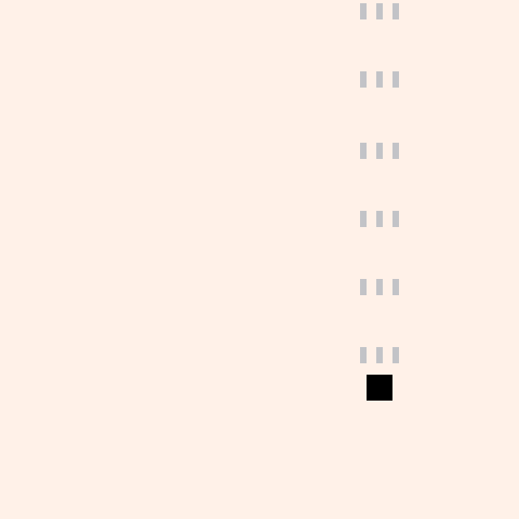

# Shoot 'Em Up

Shoot 'em ups (a.k.a. shmups, STGs, shooters) are games where you pilot a ship
and fire bullets. Your goal is simple: survive and defeat enemies. But with that
simple goal, there's challenge, fun, and depth. Many shmups have scoring
systems, adding even more replayability to game. Shmups go back decades. I'm
talking about games like _Galaga_, _R-Type_, _Dodonpachi_. Intense action games
with an arcade lineage. They also happen to be my favorite type of game to play
and make.

TODO: screenshot showing an example of the game type or what we'll make

Shmups are great for learning how to make games because you can build something
fun and challenging and begin iterating on it quickly, experimenting with
systems and enemy behaviors. The core of the game is having a playable ship that
can fire bullets, enemies that spawn and attack, and some sort of win state.
These simple basics can be expanded upon endlessly.

For our shoot 'em up, we're going to make a game where enemies spawn in waves.
You have to defeat them (or they have to exit the screen) before the next wave
spawns. You'll have 60 seconds survive, defeat as many enemies as possible, and
get the high score. Some enemies will dive down the screen, others will fire
bullets at the player. By the end of this chapter, we'll have made a shmup that
you can tune, expand, and make your own. We'll also dive deep on collision
detection and finding a balance between challenging gameplay and enjoyable
dodging.

This chapter builds upon the foundations from
[the Dodge 'Em Up](/01-dodge-em-up.html) chapter, so if you're new to
programming and Usagi Engine, read that first.

## Moveable Player

Ensure you have [Usagi Engine](https://usagiengine.com) installed. Run
`usagi init shmup` to create your new project. Open your new project folder in
your code editor. Then run `usagi dev` in the folder to start up your game in
dev mode.

We'll start by drawing a square to represent our player that can be moved around
the screen. In the Dodge 'Em Up chapter, you may have noticed that if you press
Up and Right (or any diagonal combination), the player moved faster than they
did when moving in the cardinal directions. In a lot of shmups, this isn't
ideal, as you want movement to be precise. In order to make the distanced
traveled in all 8 possible directions the same, we need to **normalize** our
input.

Here's the starting place for our game in `main.lua`:

```lua
{{#include code/02-shoot-em-up/01-moveable-player/main.lua}}
```

We set `player_size` and `player_speed` variables. The `local` keyword is new
and worth explaining a bit, as it impacts how Usagi's live reload works and
what's accessible in your game's source code as it expands into multiple files.

By default, when you create a variable in Lua, like `x = 10`, it is a **global**
variable. That means that any part of your game's source code can read its value
and even change it. This is powerful but risky. It's easy to accidentally
sometimes create global variables and accidentally change them when you didn't
intend to. When Usagi live reloads your games code, it **does not** update
global variables unless you press <kbd>Ctrl + R</kbd> or <kbd>F5</kbd>. On the
other hand, the `local` keyword says: only within this file or function or chunk
of code is this variable accessible. Usagi **does** re-evaluate `local`
variables when you change them. For our `player_size` and `player_speed`, if you
change them and save `main.lua`, the engine will re-evaluate your new values.
This is helpful for tuning speed and trying out different values to see what
feels right.

In our `_config()` function, we set the `name` of our game and the `game_id`.
Change the `game_id` to `com.usagiengine.YOURUSERNAME.shmup`, where you actually
put in your username/handle. This should be a unique identifier for your game,
which is used for the save data location on people's computers. The `game_width`
and `game_height` tell Usagi Engine to make our game field those specified
sizes. You can change these values to whatever you want, but for our game, a
square field feels good since you don't have to worry about covering a wide
distance to reach enemies on the other side of the screen. Enemies will fly in
from the top, which will make our shoot 'em up a vertically-oriented game.

In `_init()`, we create a global `State` table with our `player`'s position.
`State` is a common way in Usagi games to have a global to contain all of the
game's data, allowing for easy access. Since `State` is global, it doesn't
change when the game is live reloaded, which is what we want. This lets our
player stay in the same position when our game code changes. You could change
`player_speed` and instantly test that new value without the entire game
reseting. The math in the `player` `x` and `y` value centers our player
horizontally and places the `y` value 60 pixels up from the bottom of the game.
The values of `usagi.GAME_W` and `usagi.GAME_H` correspond to what we set in
`_config`. Yoou could just hardcode `320` instead for each of them, but if you
decide to change the width or height of your game, you'll be left searching for
and updating all of those old values. When possible, it's best to not use
**magic numbers** for values in our game.

The `_update` function contains our player movement, similar to Dodge 'Em Up.
Except rather than changing the player's `x` and `y` value in the `if` checks,
we update a variable called `input_delta`. `input_delta` is a Lua table that
lets us set whether or not there was movement on a given axis. By using `1`,
we're creating what's known as a unit vector, which makes normalizing it on the
diagonals easier. Then we call `util.vec_normalize(input_delta)` after our input
checks. `util` is a collection of functions that Usagi provides to make common
operations easier. That function returns a new table with the values normalized.

When you press right and down, rather than `x` and `y` both being `1`, the value
of both are: `0.7071...`. This makes it so that the distance traveled is the
same in all directions. We then take that normalized value and multiply it by
the `player_speed` and `dt` (`dt` is delta time, the amount of time since our
last `_update` call). This gives us the new position for the `State.player`.
After that, we prevent the player from moving off the screen by calling
`util.clamp` on the `x` and `y` position of the player. `util.clamp` takes three
values: the value you want to limit, the lower limit, and the upper limit. If
the value is below the lower limit, then the lower limit is returned. If the
value is higher than the upper limit, the upper limit is return. Otherwise, the
value is returned.

Finally, in `_draw`, we clear the screen so we have a white background. And then
draw a black rectangle at the `State.player`'s position.

This was a whole lot for the first section of our chapter, but we've got a good
starting point to build upon. Tweak the `player_speed` and `player_size` to see
what happens.

[View the source code for this section.](https://codeberg.org/brettchalupa/usagi/src/branch/main/book/src/code/02-shoot-em-up/01-moveable-player/main.lua)

## Firing Bullets

Let's make our player's ship fire bullets upward. We'll keep track of them in a
Lua table. Each frame we'll move them upward and if they scroll off the screen,
we'll remove them from the table.

Start by setting up some local variables at the top of `main.lua`:

```lua
{{#include code/02-shoot-em-up/02-firing-bullets/main.lua:3:7}}
```

We'll use all of these variables for firing and drawing bullets.

In our `State` table, add a new empty table for `bullets`:

```lua
{{#include code/02-shoot-em-up/02-firing-bullets/main.lua:20:26}}
```

We'll add new bullets into that table when they're fired and loop through it for
updating the bullets and draw them on the screen.

In our `_update` function, below where we handle player movement, add the
following code:

```lua
{{#include code/02-shoot-em-up/02-firing-bullets/main.lua:49:72}}
```

In each frame, we subtract the `dt` from `fire_timer` to count it down. Then, if
the `fire_timer` is less than or equal to `0` and the player is pressing BTN1
(keyboard: Z or gamepad: A by default), then fire three bullets. The firing of a
bullet uses the Lua function `table.insert`, which appends a new bullet at the
`x` and `y` position to `State.player.bullets` table. Then, finally, we reset
the `fire_timer` to `fire_delay`, which restarts the countdown, adding a slight
gap between each time a set of bullets get fired.

The `for i = #State.player.bullets, 1, -1 do` line of code is a loop that goes
through the player's bullets in reverse, moving them up the screen by
subtracting the `bullet_speed * dt` from each bullet's `y` position. If the
bullet is so far up the screen that's it's no longer visible (the negative
height of the bullet), then we need to remove it from the player's bullets
table. We have to loop through the bullets in reverse order so that if we do
remove a bullet, those in the array from that position onward will properly
shift into position. If you didn't reverse the order of looping through the
bullets, if you removed the first bullet, they remaining would shift forward,
causing the next iteration of the loop to skip one and potentially access an
index that no longer exists.

Now we need to draw our bullets by looping through them at the bottom of
`_draw()` and drawing a light gray rectangle:

```lua
{{#include code/02-shoot-em-up/02-firing-bullets/main.lua:82:85}}
```

The `for _, bullet in ipairs(State.player.bullets) do` line loops through each
of the bullets in `State.player.bullets`. The code between the `for ... do` and
its `end` is called for each `bullet` in that list. `ipairs` returns two values,
the index of the item in the list and the actual item in the list. We set the
index variable to `_`, meaning we don't use it.

In less than 100 lines of code, we've got a pretty good feeling player ship that
moves around the screen and fires bullets. Not bad!



[View the source code for this section.](https://codeberg.org/brettchalupa/usagi/src/branch/main/book/src/code/02-shoot-em-up/02-firing-bullets/main.lua)

## Defeating Enemies

A shmup without enemies is no shmup at all! Let's spawn enemies that fly down
the screen and when they're hit by the player's bullet, they lose health points
(HP). When their HP drops to 0, they'll disappear.

Start by defining the `local` variable `hit_flash_time`. It's the time in
seconds that an enemy will flash then they're hit by a bullet:

```lua
{{#include code/02-shoot-em-up/03-enemies/main.lua:8}}
```

Then define a new function that returns a new enemy table at a given position.
This function makes it easy to keep all of the different of an enemy close
together.

```lua
{{#include code/02-shoot-em-up/03-enemies/main.lua:20:31}}
```

We'll call this function soon. The returned table has the width (`w`) and height
(`h`), the `color`, the `speed`, and the `flash_timer` to keep track of changing
the enemy's color when they're hit. It's worth noting that there's a downside to
putting all of these values in a table like this: when our game code live
reloads, the `State.enemies` contains the old values, not the new ones until
either new enemies spawn or you press <kbd>Ctrl + R</kbd> to reload your game.
Since our game is so simple right now, that's not a big deal. But it's worth
seeing the difference in approach compared to using `local` variables we use the
different player properties. Later on this chapter, we'll break up our code into
multiple files and revise how this is handled. But for now, reutnring the table
like this works.

We'll store our enemies in a table in `State`, spawning three of them with our
new `init_enemy` function:

```lua
{{#include code/02-shoot-em-up/03-enemies/main.lua:33:46}}
```

Then in `_update`, in our bullet loop, loop through each enemy and check if the
bullet overlaps with any of the enemies:

```lua
{{#include code/02-shoot-em-up/03-enemies/main.lua:87:102}}
```

`util.rect_overlap` is a function Usagi provides that checks if two rectangles
are intersecting. It returns `true` if they are. Each rectangle passed to this
function must be a table with an `x`, `y`, `w`, and `h` key and value. If they
do overlap, then we set the bullet's `dead` property to `true`, reduce the
enemy's `hp`, and set the enemy's `flash_timer` to the `local` variable we
created earlier for how long to change the color when the enemy is hit.

Then, right after that, where we were checking for bullets that fly off the
screen, we _also_ check if `bullet.dead` to see if we should remove dead bullets
as well. Just add `or bullet.dead` to the check that previously existed.

Now, similar to bullets and still in `_update`, we need to move our enemies down
the screen and remove them if they've run out of hp or fly off the screen:

```lua
{{#include code/02-shoot-em-up/03-enemies/main.lua:105:117}}
```

We loop through in reverse, just like bullets. And we set `enemy.flash_timer` to
the previous value minus `dt`, reducing that timer. We'll check that in the
`_draw` code to know which color to draw the enemy.

When we defeat all of our enemies, let's spawn some more, at the end of our
`_update` function:

```lua
{{#include code/02-shoot-em-up/03-enemies/main.lua:119:132}}
```

There's nothing too fancy here. We check if the number of enemies is `0` and
spawn more if so.

In `_draw`, after we draw our player rectangle but _before_ we draw bullets,
we'll loop through each enemy and draw them, factoring in whether or not their
`flash_timer` is greater than `0`. If it is, then we'll draw the enemy as pink
instead of the red that we set in `init_enemy`:

```lua
{{#include code/02-shoot-em-up/03-enemies/main.lua:142:148}}
```

Our game is starting to have glimmers of being fun with enemies endlessly
approach and bullets we can hit them with.

## Enemy Bullets - Aimed Shots

Our game is a bit easy though. Sure, we could make the enemies move faster or
spawn more of them. But the best way to add challenge (and fun) is to make the
enemies fire back. In shoot 'em ups, there are two broad categories of enemy
shot types: aimed shots that move toward the player's position and shots that
move in a specific pattern, regardless of the player's location. We'll focus on
aimed shots in this section, making our enemies fire bullets toward the player's
position at the time of fire. This allows the player to dodge them by always
needing to stay in motion. This is slightly different than a _homing_ shot,
which would follow the player where they move, requiring them to either shoot
the missle down or somehow shake it off (homing shots would be a cool thing for
you to add at the end!).

TODO: enemy spits out 3 bullets in succession in an aimed shot at the player;
enemy bullets get drawn on top of everything else, player collision that kills
the bullet

## Player Death

TODO: explain how to do hit detection with the enemy bullets and the player

## Enemy Bullets - Spiral Pattern

TODO: add a second kind of enemy that fires a spiral pattern with some
parameters that can be tuned

## Waves of Enemies

TODO: build a table of enemies and have them spawn one after the other

## Time Over

TODO: counting down time that remains from 60s

## Scoring

TODO: killing enemies faster leads to higher score

## High Score Tracking

TODO: saving it, displaying it, loading it

## Sound Effects

TODO: explain how to make sfx and play them back in the game; player shot, enemy
hit, enemy explosion, player death; using pitch variation and tweaking volume a
bit

## Starfield Background

TODO: render a starfield that scrolls by at varying rates and sizes

## Bonus Credits

TODO: list out ways to expand upon the shmup; ideas: bombs, music, sprites,
explosion effects, adding homing shots/missles
