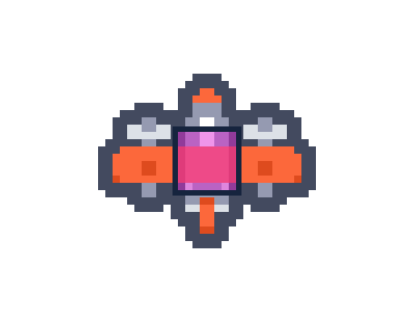

# Shoot 'Em Up

Shoot 'em ups (a.k.a. shmups, STGs, shooters) are games where you pilot a ship
and fire bullets. Your goal is simple: survive and defeat enemies. But with that
simple goal, there's challenge, fun, and depth. Many shmups have scoring
systems, adding even more replayability to game. Shmups go back decades. I'm
talking about games like _Galaga_, _R-Type_, _Dodonpachi_. Intense action games
with an arcade lineage. They also happen to be my favorite type of game to play
and make.

TODO: screenshot showing an example of the game type or what we'll make

Shmups are great for learning how to make games because you can build something
fun and challenging and begin iterating on it quickly, experimenting with
systems and enemy behaviors. The core of the game is having a playable ship that
can fire bullets, enemies that spawn and attack, and some sort of win state.
These simple basics can be expanded upon endlessly.

For our shoot 'em up, we're going to make a game where enemies spawn in waves.
You have to defeat them (or they have to exit the screen) before the next wave
spawns. You'll have 60 seconds survive, defeat as many enemies as possible, and
get the high score. Some enemies will dive down the screen, others will fire
bullets at the player. By the end of this chapter, we'll have made a shmup that
you can tune, expand, and make your own. We'll also dive deep on collision
detection and finding a balance between challenging gameplay and enjoyable
dodging.

This chapter builds upon the foundations from
[the Dodge 'Em Up](/01-dodge-em-up.html) chapter, so if you're new to
programming and Usagi Engine, read that first.

## Moveable Player

Ensure you have [Usagi Engine](https://usagiengine.com) installed. Run
`usagi init shmup` to create your new project. Open your new project folder in
your code editor. Then run `usagi dev` in the folder to start up your game in
dev mode.

We'll start by drawing a square to represent our player that can be moved around
the screen. In the Dodge 'Em Up chapter, you may have noticed that if you press
Up and Right (or any diagonal combination), the player moved faster than they
did when moving in the cardinal directions. In a lot of shmups, this isn't
ideal, as you want movement to be precise. In order to make the distanced
traveled in all 8 possible directions the same, we need to **normalize** our
input.

Here's the starting place for our game in `main.lua`:

```lua
{{#include code/02-shoot-em-up/01-moveable-player/main.lua}}
```

We set `player_size` and `player_speed` variables. The `local` keyword is new
and worth explaining a bit, as it impacts how Usagi's live reload works and
what's accessible in your game's source code as it expands into multiple files.

In our `_config()` function, we set the `name` of our game and the `game_id`.
Change the `game_id` to `com.usagiengine.YOURUSERNAME.shmup`, where you actually
put in your username/handle. This should be a unique identifier for your game,
which is used for the save data location on people's computers. The `game_width`
and `game_height` tell Usagi Engine to make our game field those specified
sizes. You can change these values to whatever you want, but for our game, a
square field feels good since you don't have to worry about covering a wide
distance to reach enemies on the other side of the screen. Enemies will fly in
from the top, which will make our shoot 'em up a vertically-oriented game.

In `_init()`, we create a global `State` table with our `player`'s position.
`State` is a common way in Usagi games to have a global to contain all of the
game's data, allowing for easy access. Since `State` is global, it doesn't
change when the game is live reloaded, which is what we want. This lets our
player stay in the same position when our game code changes because `State` is
only reassigned when `_init` is called, which happens when you launch your game
or press <kbd>Ctrl+R</kbd>. You could change `player_speed` and instantly test
that new value without the entire game reseting. The math in the `player` `x`
and `y` value centers our player horizontally and places the `y` value 60 pixels
up from the bottom of the game. The values of `usagi.GAME_W` and `usagi.GAME_H`
correspond to what we set in `_config`. Yoou could just hardcode `320` instead
for each of them, but if you decide to change the width or height of your game,
you'll be left searching for and updating all of those old values. When
possible, it's best to not use **magic numbers** for values in our game.

The `_update` function contains our player movement, similar to Dodge 'Em Up.
Except rather than changing the player's `x` and `y` value in the `if` checks,
we update a variable called `input_delta`. `input_delta` is a Lua table that
lets us set whether or not there was movement on a given axis. By using `1`,
we're creating what's known as a unit vector, which makes normalizing it on the
diagonals easier. Then we call `util.vec_normalize(input_delta)` after our input
checks. `util` is a collection of functions that Usagi provides to make common
operations easier. That function returns a new table with the values normalized.

When you press right and down, rather than `x` and `y` both being `1`, the value
of both are: `0.7071...`. This makes it so that the distance traveled is the
same in all directions. We then take that normalized value and multiply it by
the `player_speed` and `dt` (`dt` is delta time, the amount of time since our
last `_update` call). This gives us the new position for the `State.player`.
After that, we prevent the player from moving off the screen by calling
`util.clamp` on the `x` and `y` position of the player. `util.clamp` takes three
values: the value you want to limit, the lower limit, and the upper limit. If
the value is below the lower limit, then the lower limit is returned. If the
value is higher than the upper limit, the upper limit is return. Otherwise, the
value is returned.

If you went through the _Dodge 'Em Up_ chapter, you might be wondering what `+=`
and `-=` means since we didn't use that syntax in the first chapter. Those are
called **compound assignment operators**. Lua doesn't support them by default
but Usagi pre-processes your source code to add support for them. So
`input_delta.y -= 1` is the same as `input_delta.y = input_delta.y - 1`. It's a
more convenient shorthand.

Finally, in `_draw`, we clear the screen so we have a white background. And then
draw a black rectangle at the `State.player`'s position.

This was a whole lot for the first section of our chapter, but we've got a good
starting point to build upon. Tweak the `player_speed` and `player_size` to see
what happens.

[View the source code for this section.](https://codeberg.org/brettchalupa/usagi/src/branch/main/book/src/code/02-shoot-em-up/01-moveable-player/main.lua)

## Firing Bullets

Let's make our player's ship fire bullets upward. We'll keep track of them in a
Lua table. Each frame we'll move them upward and if they scroll off the screen,
we'll remove them from the table.

Start by setting up some local variables at the top of `main.lua`:

```lua
{{#include code/02-shoot-em-up/02-firing-bullets/main.lua:3:7}}
```

We'll use all of these variables for firing and drawing bullets.

In our `State` table, add a new empty table for `bullets`:

```lua
{{#include code/02-shoot-em-up/02-firing-bullets/main.lua:20:26}}
```

We'll add new bullets into that table when they're fired and loop through it for
updating the bullets and draw them on the screen.

**Note**: when you add a new entry to `State` (or any table that's only
initialized in `_init()`), you may see an error pop-up the first time you make
use of it in your code. The error will be about trying to do something with that
new table entry, like nil arithmetic error or something similar. This is because
Usagi's live reload when you change your source doesn't call `_init()` and the
code is trying to access the table entry that doesn't exist yet (it's `nil`).
Usagi's live reload not calling `init()` allows you to have game state that
doesn't get wiped on each live reload, which is ideal when testing changes you
just made. You don't lose your level or hp or whatever it is your game has in
it. But if you change something within `_init()`, you need to _hard reload_ your
game to get that value populated. Press <kbd>Ctrl + R</kbd> or <kbd>F5</kbd> to
hard reload your game and run `_init()` again. When you see an error and aren't
sure what to do, try a hard reload first!

In our `_update` function, below where we handle player movement, add the
following code:

```lua
{{#include code/02-shoot-em-up/02-firing-bullets/main.lua:49:72}}
```

In each frame, we subtract the `dt` from `fire_timer` to count it down. Then, if
the `fire_timer` is less than or equal to `0` and the player is pressing BTN1
(keyboard: Z or gamepad: A by default), then fire three bullets. The firing of a
bullet uses the Lua function `table.insert`, which appends a new bullet at the
`x` and `y` position to `State.player.bullets` table. Then, finally, we reset
the `fire_timer` to `fire_delay`, which restarts the countdown, adding a slight
gap between each time a set of bullets get fired.

The `for i = #State.player.bullets, 1, -1 do` line of code is a loop that goes
through the player's bullets in reverse, moving them up the screen by
subtracting the `bullet_speed * dt` from each bullet's `y` position. If the
bullet is so far up the screen that's it's no longer visible (the negative
height of the bullet), then we need to remove it from the player's bullets
table. We have to loop through the bullets in reverse order so that if we do
remove a bullet, those in the array from that position onward will properly
shift into position. If you didn't reverse the order of looping through the
bullets, if you removed the first bullet, they remaining would shift forward,
causing the next iteration of the loop to skip one and potentially access an
index that no longer exists.

Now we need to draw our bullets by looping through them at the bottom of
`_draw()` and drawing a light gray rectangle:

```lua
{{#include code/02-shoot-em-up/02-firing-bullets/main.lua:82:85}}
```

The `for _, bullet in ipairs(State.player.bullets) do` line loops through each
of the bullets in `State.player.bullets`. The code between the `for ... do` and
its `end` is called for each `bullet` in that list. `ipairs` returns two values,
the index of the item in the list and the actual item in the list. We set the
index variable to `_`, meaning we don't use it.

In less than 100 lines of code, we've got a pretty good feeling player ship that
moves around the screen and fires bullets. Not bad!


[View the source code for this section.](https://codeberg.org/brettchalupa/usagi/src/branch/main/book/src/code/02-shoot-em-up/02-firing-bullets/main.lua)

## Defeating Enemies

A shmup without enemies is no shmup at all! Let's spawn enemies that fly down
the screen and when they're hit by the player's bullet, they lose health points
(HP). When their HP drops to 0, they'll disappear.

Start by defining the `local` variable `hit_flash_time`. It's the time in
seconds that an enemy will flash then they're hit by a bullet:

```lua
{{#include code/02-shoot-em-up/03-enemies/main.lua:8}}
```

Then define a new function that returns a new enemy table at a given position.
This function makes it easy to keep all of the different of an enemy close
together.

```lua
{{#include code/02-shoot-em-up/03-enemies/main.lua:20:31}}
```

We'll call this function soon. The returned table has the width (`w`) and height
(`h`), the `color`, the `speed`, and the `flash_timer` to keep track of changing
the enemy's color when they're hit. It's worth noting that there's a downside to
putting all of these values in a table like this: when our game code live
reloads, the `State.enemies` contains the old values, not the new ones until
either new enemies spawn or you press <kbd>Ctrl + R</kbd> to reload your game.
Since our game is so simple right now, that's not a big deal. But it's worth
seeing the difference in approach compared to using `local` variables we use the
different player properties. Later on this chapter, we'll break up our code into
multiple files and revise how this is handled. But for now, reutnring the table
like this works.

We'll store our enemies in a table in `State`, spawning three of them with our
new `init_enemy` function:

```lua
{{#include code/02-shoot-em-up/03-enemies/main.lua:33:46}}
```

Then in `_update`, in our bullet loop, loop through each enemy and check if the
bullet overlaps with any of the enemies:

```lua
{{#include code/02-shoot-em-up/03-enemies/main.lua:87:102}}
```

`util.rect_overlap` is a function Usagi provides that checks if two rectangles
are intersecting. It returns `true` if they are. Each rectangle passed to this
function must be a table with an `x`, `y`, `w`, and `h` key and value. If they
do overlap, then we set the bullet's `dead` property to `true`, reduce the
enemy's `hp`, and set the enemy's `flash_timer` to the `local` variable we
created earlier for how long to change the color when the enemy is hit.

Then, right after that, where we were checking for bullets that fly off the
screen, we _also_ check if `bullet.dead` to see if we should remove dead bullets
as well. Just add `or bullet.dead` to the check that previously existed.

Now, similar to bullets and still in `_update`, we need to move our enemies down
the screen and remove them if they've run out of hp or fly off the screen:

```lua
{{#include code/02-shoot-em-up/03-enemies/main.lua:105:117}}
```

We loop through in reverse, just like bullets. And we set `enemy.flash_timer` to
the previous value minus `dt`, reducing that timer. We'll check that in the
`_draw` code to know which color to draw the enemy.

When we defeat all of our enemies, let's spawn some more, at the end of our
`_update` function:

```lua
{{#include code/02-shoot-em-up/03-enemies/main.lua:119:132}}
```

There's nothing too fancy here. We check if the number of enemies is `0` and
spawn more if so.

In `_draw`, after we draw our player rectangle but _before_ we draw bullets,
we'll loop through each enemy and draw them, factoring in whether or not their
`flash_timer` is greater than `0`. If it is, then we'll draw the enemy as pink
instead of the red that we set in `init_enemy`:

```lua
{{#include code/02-shoot-em-up/03-enemies/main.lua:142:148}}
```

Our game is starting to have glimmers of being fun with enemies endlessly
approach and bullets we can hit them with.

## Enemy Bullets - Aimed Shots

Our game is a bit easy though. Sure, we could make the enemies move faster or
spawn more of them. But the best way to add challenge (and fun) is to make the
enemies fire back. In shoot 'em ups, there are two broad categories of enemy
shot types: aimed shots that move toward the player's position and shots that
move in a specific pattern, regardless of the player's location. We'll focus on
aimed shots in this section, making our enemies fire bullets toward the player's
position at the time of fire. This allows the player to dodge them by always
needing to stay in motion. This is slightly different than a _homing_ shot,
which would follow the player where they move, requiring them to either shoot
the missle down or somehow shake it off (homing shots would be a cool thing for
you to add once this chapter is over!).

We'll make our enemy bullets quite large compared to the player's. Add a new
variable at the top of the file for representing the width and height of the
enemy bullets:

```lua
{{#include code/02-shoot-em-up/04-aimed-bullets/main.lua:9}}
```

Add two new properties to our returned enemy table in `init_enemy()` that we can
use to track when a enemy should fire a bullet:

```lua
{{#include code/02-shoot-em-up/04-aimed-bullets/main.lua:31:34}}
```

`fire_timer` will be used to countdown 1.5 seconds and then have the enemy fire
their first bullet. We'll reset `fire_timer` after each shot to `fire_delay`,
which will set the delay of future shots to 0.2s. We'll use `shots_fired` to
count how many times the enemy has spat out a bullet and stop firing once that
number reaches `shots_limit`.

In the `_init` function's `State` table, add a new key: `enemy_bullets` that's
initialized to an empty table: `{}`:

```lua
{{#include code/02-shoot-em-up/04-aimed-bullets/main.lua:50}}
```

We'll keep track of enemy bullets _separate_ from each enemy so that even after
an enemy dies or flies of their screen, their bullets live on, carrying out
their mission to destroy us.

We need to make it so that our enemies fire bullets in our `_update` function
within the enemies loop. We'll be calculating the linear velocity of the bullet
based on the angle of the enemy toward the player. We'll use the power of
trigonometry to accomplish this! Right after the code where we handle updating
the enemy's flash timer, add this:

```lua
{{#include code/02-shoot-em-up/04-aimed-bullets/main.lua:120:142}}
```

There's a lot here. Let's break it down and go over what's happening.

We subtract `dt` from the enemy's `fire_timer` so that it counts down, just like
our other timers. Then, if the `fire_timer` is less than or equal to 0 **and**
the number of shots fired is less than the limit, we insert a new bullet into
`State.enemy_bullets`. In order to properly aim the bullet at the player, we
need to calculate the angle at which the bullet needs to travel based on the
enemy that's firing the bullet's position and the player's position at the time
of fire. This is calculated using the arctangent of the y position delta and x
position delta. Then we increment the enemy's `shots_fired` and reset the
`fire_timer` for future checks as to whether or not the enemy should fire
another bullet.

If you're curious about the deeper trigonometric aspects of the arctangent
calculate,
[check out the Wikipedia page on Inverse trigonometric functions](https://en.wikipedia.org/wiki/Inverse_trigonometric_functions).
If you're not curious, just accept that's how aimed shots work and move on. For
what it's worth, these aspects of math in game programming make my head spin
still (maybe a sign I should study it more!).

Right below the enemy loop in `_update`, in a new loop, we need to loop through
each enemy bullet, update its position, check for overlap with the player, and
remove any bullets that are dead or offscreen:

```lua
{{#include code/02-shoot-em-up/04-aimed-bullets/main.lua:149:165}}
```

We need to take the `bullet.angle` into account when we move the bullet. In
order to calculate the linear velocity, we pass that `bullet.angle` into
`math.cos` for the `x` velocity and `math.sin` for the `y` velocity, multiplying
it by enemy bullet's speed and `dt`.

We then check if the bullet's rectangle overlaps the player's rectangle. If so,
the bullet is dead. (And in the future, the player will die too.)

At the end of the enemy bullet update loop, we remove any dead bullets or those
that are off screen.

Finally, loop through and draw each of the `State.enemy_bullets` _after_ we draw
the player bullets:

```lua
{{#include code/02-shoot-em-up/04-aimed-bullets/main.lua:203:206}}
```

There's nothing particularly special about this code, we draw a blue square to
represent the enemy bullets.

The Usagi `_draw` loop draws in order of the `gfx` calls. Each proceeding `gfx`
call draws on top of the previous ones. In shmups, it's absolutely **vital**
that enemies and bullets are visible. So we draw the enemy bullets last, on top
of everything else.

Enemy bullet firing is one of the more complex parts of our shmup. Now that
we've cleared that hurdle, we'll be making some smaller changes to make our game
more challenging and fun.

Tune some of the different values in the code to see what feels good, like try
changing the bullet size, the fire delay, how many shots get fired. When making
games, once you have the systems in place, you can turn the knobs and see what
happens, which can often lead to some delightful surprises in your game's
design.

[View the source code for this section.](https://codeberg.org/brettchalupa/usagi/src/branch/main/book/src/code/02-shoot-em-up/04-aimed-bullets/main.lua)

## Hitboxes

Our game currently uses the entire player's rectangle to check for collisions
with enemy bullets. This makes our game quite difficult, and in many modern
shmups, the _hitbox_ of the player is a much smaller square in the center.
Hitboxes are a game dev term that represent a specific shape that's used for hit
detection.

Here's a sprite from the art Kenney with a box I've drawn over it:



That pink-ish box would make for a more player-friendly hitbox, allowing for
easier dodging and less frustrating gameplay. In some shmups, the hitbox is even
smaller.

Let's make our player's hitbox smaller than the black square we draw and use
that for collision detection. In `main.lua`, create a new function called
`player_hitbox`. It will return a Lua table representing the rectangle we want
to use:

```lua
{{#include code/02-shoot-em-up/05-hitboxes/main.lua:38:46}}
```

The returned table is a small square centered on the player's location.

In the `_update` function where we loop through the `#State.enemy_bullets` and
call `util.rect_overlap` and pass in two tables to represent the bullet's hitbox
and the player's hitbox, change the second argument to instead call out to our
new function:

```lua
{{#include code/02-shoot-em-up/05-hitboxes/main.lua:165:170}}
```

**Aside:** if you wanted, you could even make the enemy bullet hitbox smaller
than the bullet's size. Or extract it into a function and make it the exact
same. It'd make the code a little bit cleaner.

Let's draw the player's hitbox as a white dot in the middle of the player in
`_draw` right after we draw our player:

```lua
{{#include code/02-shoot-em-up/05-hitboxes/main.lua:199:203}}
```

The reason we wrote the `player_hitbox` code insead of creating that table over
and over to represent the hitbox is so that we could reuse that code in the
`_update` collision detection code and we could then use it in `_draw`. By
consolidating the code into one place, this makes it much easier to change. If
you decide to make the hitbox smaller, just update `hitbox_size` in that single
place. This principle of don't repeat yourself (DRY) is quite useful for making
code easier to change and understand.

[View the source code for this section.](https://codeberg.org/brettchalupa/usagi/src/branch/main/book/src/code/02-shoot-em-up/05-hitboxes/main.lua)

## Refactoring Our Code

On the topic of code quality, there's something that's not great about our
`main.lua` code right now. It's the `_update` function. It's over 100 lines
long, and it's doing a lot of important work. Let's break that code down into
smaller, reusable functions. This process of reorganizing our code is called
**refactoring**. It's a way to step back and assess the code that exists and try
to answer the question: _can this be organized better so I can better understand
it and more easily change it in the future?_ A key part of refactoring is that
we don't want to change the functionality.

When I read through our `_update` function, I see it handling some distinct
functionalities:

- Updating the player's position based on input
- Handling firing the player's bullets
- Updating the player's bullets and checking for collisions with enemies
- Updating enemies positions and firing the enemies' bullets
- Updating enemy bullets and checking for collisions with the player
- Spawning more enemies

These all naturally break down into distinct functions that we can call. Take
those logical groupings, give them names, and then call those functions in
`_update`:

```lua
{{#include code/02-shoot-em-up/06-refactoring/main.lua:64:71}}
```

Doesn't `_update` just feel better now? It's clear to see the order of
operations. And then if we need to change enemy behavior, we go to the
`update_enemies` function.

We use the `update_*` prefix to make it clear that the code is called in the
`_update` function. The `try_spawn_enemies` function uses the `try_*` suffix
because it doesn't spawn enemies every time it's called. It only does it is
there are currently 0 enemies. If the function was just named `spawn_enemies`,
when you read it in `_update`, you might think it's always spawning enemies. By
naming it `try_spawn_enemies`, it implies that certain conditions must be met
for a spawn event to happen.

All of our new functions look like this:

```lua
{{#include code/02-shoot-em-up/06-refactoring/main.lua:104:241}}
```

Every function we extracted except `try_spawn_enemies` needs `dt` passed in. But
none of the actual code within the functions has changed. That's a clean
refactor!

**Aside:** A natural next step would be to extract our functions into different
files to further organize our code. That's beyond the scope of this chapter, but
that'd be something great for you to explore on your own if you're interested in
that. There are some natural groupings so far, like `player.lua`, `enemy.lua`,
`bullet.lua`.

[View the source code for this section.](https://codeberg.org/brettchalupa/usagi/src/branch/main/book/src/code/02-shoot-em-up/06-refactoring/main.lua)

## Game Over

When our player gets hit by bullets, nothing consequential happens. Much like in
the _Dodge 'Em Up_ chapter, we'll make it trigger a game over and allow the
player to restart to try again.

Start by adding a `game_over` key to the `State` table:

```lua
{{#include code/02-shoot-em-up/07-game-over/main.lua:61}}
```

Then, in our new `update_enemy_bullets` function, in addition to setting the
bullet to to `dead`, we'll also set the `State.game_over` to `true`:

```lua
{{#include code/02-shoot-em-up/07-game-over/main.lua:229:237}}
```

We also call out to two functions Usagi provides: `effect.flash` and
`effect.screen_shake`. They add a little bit of juice to the game by flashing
the screen white for 0.4 seconds and then shaking the screen at intensity level
2 for 0.8 seconds. While you don't want to go overboard with these effects,
using them wisely can make your game feel more alive and polished.

In `_update`, check if `State.game_over` and check for player input to restart
the game, otherwise call our normal update functions:

```lua
{{#include code/02-shoot-em-up/07-game-over/main.lua:65:78}}
```

When `game_over` is true, we check to see if the player has pressed BTN1, and if
they have, just call the game's `_init()` to start it all over again.

If the player is dead, we shouldn't draw their square in `_draw()`, so add this
conditional check:

```lua
{{#include code/02-shoot-em-up/07-game-over/main.lua:83:93}}
```

We need to let the player know it's game over, so in `_draw()` render text at
the very end of the function:

```lua
{{#include code/02-shoot-em-up/07-game-over/main.lua:113:117}}
```

While we could only draw the enemies and bullets if it's not game over, it's fun
to draw them when they're not updating, leading to a freeze frame effect when
the player dies.

This is starting to fee like a real game! Play it for a bit and tune the enemy
speeds, the bullet speeds, and whatever else is variable to see what feels best
to you.

[View the source for this section.](https://codeberg.org/brettchalupa/usagi/src/branch/main/book/src/code/02-shoot-em-up/07-game-over/main.lua)

## Enemy Waves

Spawning enemies over and over in the same position isn't very fun. Let's set up
our game so that we can define the waves of enemy in an easy way that makes it
possible for us to design the encounters. We'll have enemies fly down at various
locations, giving our game a flow for the player to navigate through.

The simplest way to set this up is to create an array table where each item in
the array is its own array table of spawn positions.

```lua
{{#include code/02-shoot-em-up/08-enemy-waves/main.lua:10:32}}
```

Put the game width and height into local variables so that we can reference them
in our `WAVES` positions. When we want enemies to spawn on the right side of the
screen, subtract some pixels from `GAME_W`. You could just hardcode the values
too.

Two things to note:

1. You might think: let's use `usagi.GAME_W` since we set that in `_config()`,
   but that will actually lead to a bug because `usagi.GAME_W` when used outside
   of a function will be different than what we set in `_config()`. (This is
   something I want to fix in a future version of Usagi).
2. In some programming languages and in this book, it's common to capitalize all
   the characters of a variable value that isn't meant to change. Lua doesn't
   have a concept of constants, so in order to signify that game width and
   height and our waves don't change, they're written in `SCREAMING_SNAKE_CASE`.

Each item in the `WAVES` array contains an array of spawn positions. In order to
keep the code concise, we just use an array to represent the x and y position,
that way we don't have to type `{ x = 72, y = -20 }` over and over again. The
first value is x, the second is y.

The arrays are nested three levels deep, but it makes it easy to add new waves
and edit the existing enemy spawns. Also, you don't have to format your code
like it is in the book. Some editors automatically format code on save to make
it easier to read.

In `_config`, let's use our new `GAME_W` and `GAME_H`:

```lua
{{#include code/02-shoot-em-up/08-enemy-waves/main.lua:35:43}}
```

In `_init`, change `State.enemies` to be an empty table and set `current_wave`
to `0`:

```lua
{{#include code/02-shoot-em-up/08-enemy-waves/main.lua:72:84}}
```

By setting `current_wave` to `0`, we'll let our game's revised
`try_spawn_enemies` handle incrementing it and spawn the enemies of the 1st
wave, which will populate `State.enemies`. Revise the `try_spawn_enemies`
function to be:

```lua
{{#include code/02-shoot-em-up/08-enemy-waves/main.lua:268:276}}
```

It checks if the length of `State.enemies` is `0` because the enemies all died
or flew off the screen. But it also checks if `State.current_wave` is less than
the total number of waves in `WAVES`. If both are true, then it's time to spawn
the next wave of enemies. Spawning enemies from the current wave consists of
reseting `State.enemies` to an empty table `{}` just to be sure there's nothing
weird lingering. Then we loop through each spawn location of the current wave,
inserting the enemy into the `State.enemies` table. Since we set all of the `y`
values to be negative in `WAVES`, they fly in from the top of the screen. We
access the first element, the x value, with `enemy[1]` and the second element,
the y value, with `enemy[2]`.

Revise the waves in `WAVES` by adding a bunch of different encounters. Play test
your game a bunch and see what feels good. You're doing game design! **Note:**
you'll need to press <kbd>Ctrl+R</kbd> to hard reload your game to reset
`State.current_wave` to `0` if you want to test previous waves. But if you add
new `WAVES` to your running game, it'll advance through and let you play test
them right away, which is kind of nifty.

[View the source code for this section.](https://codeberg.org/brettchalupa/usagi/src/branch/main/book/src/code/02-shoot-em-up/08-enemy-waves/main.lua)

## Time Out

Let's make it so that our game is 60 seconds long. We'll add a timer that counts
down and when it hits 0, it'll be **time out** for that round. Just like when
the player dies, they can restart and play again.

You'll need to add enough `WAVES` to fill up the space of 60 seconds. Be sure to
account for skilled players who can clear the waves quickly. You don't want
someone to sit there for 20 seconds if they cleared all the waves before time
ran out.

Start by adding a new `timer` field to `State` in `_init`:

```lua
{{#include code/02-shoot-em-up/09-time-out/main.lua:83}}
```

Then in `_update` subtract `dt` from `State.timer` each frame that it's not game
over and when the timer hits `0`, set the `State.game_over` boolean to `true`:

```lua
{{#include code/02-shoot-em-up/09-time-out/main.lua:87:97}}
```

The `math.max` function call basically says, if `State.timer` is less than 0,
set it to 0 so that we can check if we've timed out. It returns the larger of
the two values. You could also write it like this:

```lua
if State.timer < 0 then
  State.timer = 0
end
```

But I thought it'd be nice for you to see another `math` function that Lua
provides.

In `_draw`, near the end so that it draws on top of everything else, render text
of the `State.timer` and when it is game over and the `State.timer` is `0`, show
a "TIME OUT" message:

```lua
{{#include code/02-shoot-em-up/09-time-out/main.lua:142:152}}
```

`string.format("%.2f", State.timer)` takes our `State.timer` value and converts
it to a string rounded to two decimal places. So it'll show as 44.32 in our
game. the 2 in `"%.2f"` means show 2 decimal places. Otherwise `State.timer`
will be many decimal places long and look bad.

[View the source code for this section.](https://codeberg.org/brettchalupa/usagi/src/branch/main/book/src/code/02-shoot-em-up/09-time-out/main.lua)

## Scoring

Let's add score tracking to our game. Scoring can encourage players to replay a
game to try to beat their previous best. We'll start with a very simple scoring
logic: when you defeat an enemy, you get 100 points.

Add new `score` key to `State` in `_init()` that we'll use to keep track of
score. Set it to `0` by default:

```lua
{{#include code/02-shoot-em-up/10-scoring/main.lua:84}}
```

In `_draw`, draw our score just like we draw our wave number:

```lua
{{#include code/02-shoot-em-up/10-scoring/main.lua:141}}
```

Because we draw the score in the upper-left corner, we need to shift the game
over and restart text down a bit by adding to their `y` draw value:

```lua
{{#include code/02-shoot-em-up/10-scoring/main.lua:147:155}}
```

In `update_player_bullets`, check to ensure that the enemy has more than `0` HP
in the overlap check so that we don't accidentally allow a second bullet
overlapping with the dead enemy to give us double score. And then add `100` to
`State.score` if we've just killed the enemy (i.e., their `hp` has dropped to
`0` or less):

```lua
{{#include code/02-shoot-em-up/10-scoring/main.lua:203:214}}
```

That's all it takes to add simple scoring to our game. In the **Bonus Credits**
section below, you'll find some ideas for how you could expand it to make it
more fun. Scoring at its best gives the player more systems to experment with
and play around with.

[View the source code for this section.](https://codeberg.org/brettchalupa/usagi/src/branch/main/book/src/code/02-shoot-em-up/10-scoring/main.lua)

## Sound Effects

Our game is feeling a bit... quiet. In fact, there's no sound at all yet. The
proper application of sound effects can make a game go from feeling just okay to
feeling real good.Let's add some basic sound effects to our game for when the
player fires, enemies get killed, and the player dies.

Usagi makes it easy to play sound effects, but we first need to make some. If
you're experienced with sound creation, use your tool of preference. I like to
use [jsfxr](https://sfxr.me/), a free web-based tool that allows you to generate
and download retro sound effects for free. Alternatively, you can find sound
effects online at places like [itch.io](https://itch.io) and
[opengameart.org](https://opengameart.org/).

For the book, let's use jsfxr. In the left column of the tool, you'll see
presets for different actions, like Pickup/coin, Laster/shoot, Explosion, and so
on. You can click those to have it generate a sound. You can click it again to
have it generate a new one. And then you can drag the sliders around to change
how your sound effect sounds. Try changing them and see what happens!

Start with **Laser/shoot** for the player's firing. Mash the **Play** button
rapidly to get a sense of how it'll sound when repeated. Something short and
quieter is ideal since it will be repeated often. Click Download:
**laserShoot.wav**. It'll put that .wav file in your Downloads folder. In your
game folder, create a new folder called `sfx` and move laserShoot.wav into it.

In `update_player_fire` in main.lua` when we fire the three player bullets, play
the new sound effect:

```lua
{{#include code/02-shoot-em-up/11-sfx/main.lua:182:185}}
```

`sfx.play` plays the corresponding sound effect in the `sfx` folder once.
`laserShoot` is the name of the sound corresponding to the file
`sfx/laserShoot.wav`.

Usagi automatically picks up your new sound effect and plays it when you fire.
Doesn't firing the player's bullets feel better already?

While it's true sound effects can make your game feel better, they can also make
the game worse if the sound effect is annoying when repeated a lot or
particularly grating. So be sure to test your sound effects and tweak them as
needed.

Repeat that process but generate an **Explosion** for enemy death. I've renamed
the explosion.wav to `enemyDeath.wav` so that we can have different explosion
sound effects.

In `update_player_bullets`, in the same place we add to the score, play the new
sound effect:

```lua
{{#include code/02-shoot-em-up/11-sfx/main.lua:212:215}}
```

Make another explosion sound effect, `playerDeath.wav`, and put it in sfx. The
player's explosion doesn't happen nearly as often as firing bullets or enemy's
dying, so make it sound impactful. In `update_enemy_bullets`, play it when an
enemy bullet overlaps with the player's hitbox:

```lua
{{#include code/02-shoot-em-up/11-sfx/main.lua:273:282}}
```

Adding sound effects makes a huge difference. Play around with making different
ones until you're happy with how it sounds.

[View the source code for this section.](https://codeberg.org/brettchalupa/usagi/src/branch/main/book/src/code/02-shoot-em-up/11-sfx/main.lua)

## Sharing Your Game

You made a wave-based shmup with a playable ship that fires bullets, enemies
that spawn and fire bullets, waves, scoring, and sound effects. Nice work!
Action games are fun to build because of the immediate feedback and how making
small tweaks and adding new systems leads to immediate feedback.

Use `usagi export` to generate cross-platform builds of your game in the
**exports** folder. You can then send your game to friends or publish it on itch
or Newgrounds or wherever. Be sure to check out
[the full guide from the Dodge 'Em Up chapter](/01-dodge-em-up.html#sharing-our-game)
if you want a deeper dive on this process.

## Bonus Credits

There's a lot you could do to expand your shmup:

- Refine the design of the waves
- Expand the game to be 120 seconds instead of 60
- Add more types of enemies that exhibit different behaviors (add a third item
  to the wave spawn arrays to represent enemy type and then in the enemy update
  and drawing code, check that value and implement behavior accordingly)
- Add sprites once you learn how to do that with Usagi Engine
- Add in music
- Add homing missiles that the enemies fire
- Make player bullets fire out in a spread with an angle + linear velocity
  rather than just upward
- Give the player more points if they kill an enemy faster, encouraging more
  aggressive play
- Add a chain system where if the gap between killing each enemy is short
  enough, you get a score multiplier
- Draw explosion circles when an enemy dies to
- Try using `sfx.play_ex` and setting a random pitch for the player's weapon
  firing to add variance, using what we learned about generating random number
  generation in the _Dodge 'Em Up_ chapter
- Add a bomb that fires when BTN2 is pressed, that creates an ever-growing
  circle that kills enemies when it encounters them

## References

- [Bomberfrog source code](https://github.com/brettchalupa/bomberfrog) — an open
  source horizontal wave-based shmup I made for a game jam
- [Bog Hog's Shmup Workshop](https://www.youtube.com/playlist?list=PLj_fo4j9ZtOlW8jUPFG-zlONynlI0ycnu)
  — video series detailing how to approach making a shmup, covering movement,
  shooting, hitboxes, scoring, pattern design, and more; there's also
  [a written version](https://shmups.wiki/library/Boghog%27s_bullet_hell_shmup_101)
- [Lazy Devs Shmup Tutorial](https://www.youtube.com/playlist?list=PLea8cjCua_P3Sfq4XJqNVbd1vsWnh7LZd)
  — guided video series on making a shmup in Pico-8; you could follow along but
  with Usagi!

## Possible Future Expansions

If you liked this chapter and want more shmup tutorials, let me know
[in Discord](https://usagiengine.com/discord)!

Here are ideas of what I'd like to add to this chapter in a possible future
expansion:

- Sprites for the player, enemies, and bullets
- Drawing a moving starfield on the background
- Adding more enemy types, like a boss
- How to code more bullet patterns, like spirals
- High score tracking with saving and loading

It's likely those concepts will be covered in future chapters too. Those would
also be great items for you to explore as part of self-learning too. If you get
stuck, let me know and I'll try to help!
